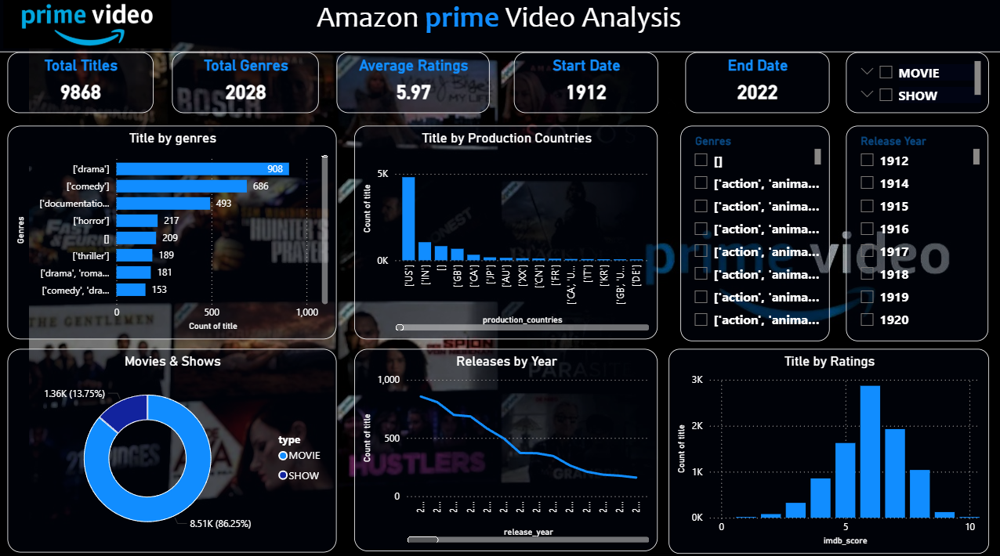

# 📊 Amazon Prime Video Analysis Dashboard

This repository contains a **Power BI dashboard** that provides a comprehensive analysis of Amazon Prime Video’s catalog.  
It explores trends in genres, production countries, ratings, release years, and overall content distribution.

---

## 🚀 Key Highlights
- **Total Titles:** 9,868  
- **Total Genres:** 2,028  
- **Average IMDb Rating:** 5.97  
- **Release Range:** 1912 – 2022  

---

## 📈 Visualizations
- **Titles by Genres (Bar Chart):** Drama (908), Comedy (666), Documentary (493), Horror (217), Thriller (209), and more  
- **Titles by Production Countries (Bar Chart):** US (~4800), India (~1000), UK (~800), followed by Canada, Japan, France, Germany, Italy, Korea  
- **Movies vs Shows (Donut Chart):**  
  - Movies: 8.51K (86.25%)  
  - Shows: 1.36K (13.75%)  
- **Releases by Year (Line Chart):** Declining trend in releases over time  
- **Titles by Ratings (Histogram):** Most titles cluster around IMDb score of 5  

---

## 📷 Dashboard Preview


---


---

## 🛠️ Data Sources
- **titles.csv** → Includes age certification, description, genres, IMDb score, votes, production country, release year, runtime, seasons, title, TMDB popularity, TMDB score, and type.  
- **credits.csv** → Contains information about cast and crew.  

---

## 🔍 Insights & Observations
- 🎬 **Drama** dominates as the most popular genre, followed by Comedy and Documentary.  
- 🌍 **US productions** form nearly half of the catalog, with India and UK contributing significantly.  
- 📺 **Movies** vastly outnumber shows, making up over 86% of the catalog.  
- 📉 **Release trend** shows a decline in recent years compared to earlier peaks.  
- ⭐ **Ratings distribution** centers around 5, suggesting average viewer reception overall.  

---

## 📌 Requirements
- Power BI Desktop (latest version recommended)  
- CSV datasets (`titles.csv` and `credits.csv`)  

---

## 🛠️ Getting Started
1. Clone this repository:
   ```bash
   git clone https://github.com/your-username/amazon-prime-video-dashboard.git


